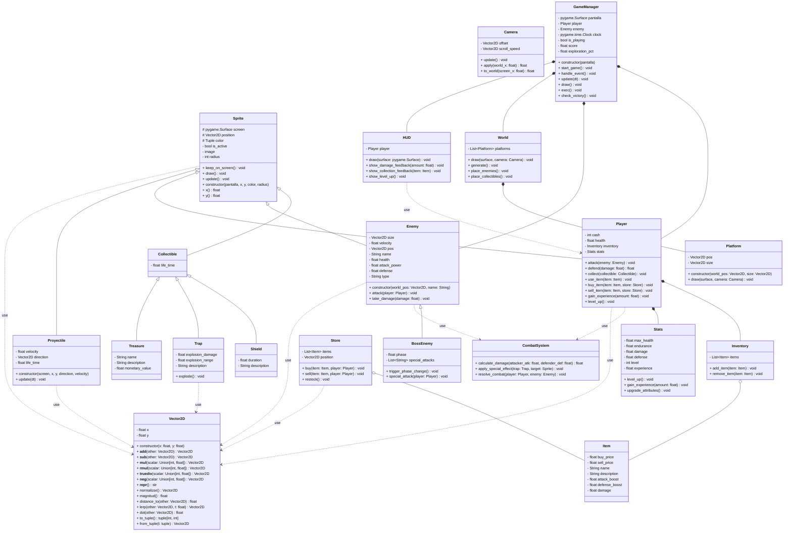

# Diagrama de Clases

```mermaid
classDiagram
    class Vector2D {
        - float x
        - float y
        + constructor(x: float, y: float)
        + __add__(other: Vector2D) Vector2D
        + __sub__(other: Vector2D) Vector2D
        + __mul__(scalar: Union[int, float]) Vector2D
        + __rmul__(scalar: Union[int, float]) Vector2D
        + __truediv__(scalar: Union[int, float]) Vector2D
        + __neg__(scalar: Union[int, float]) Vector2D
        + __repr__() str
        + normalizar() Vector2D
        + magnitud() float
        + distance_to(other: Vector2D) float
        + lerp(other: Vector2D, t: float) Vector2D
        + dot(other: Vector2D) float
        + to_tuple() tuple[int, int]
        + from_tuple(t: tuple) Vector2D
    }

    class Sprite {
        # pygame.Surface screen
        # Vector2D position
        # Tuple color
        - bool is_active
        - image
        - int radius
        + keep_on_screen() void
        + draw() void
        + update() void
        + constructor(pantalla, x, y, color, radius)
        + x() float
        + y() float
    }

    class Stats {
        - float max_health
        - float endurance
        - float damage
        - float defense
        - int level
        - float experience
        + level_up() void
        + gain_experience(amount: float) void
        + upgrade_attributes() void
    }

    class Inventory {
        - List~Item~ items
        + add_item(item: Item) void
        + remove_item(item: Item) void
    }

    class Player {
        - int cash
        - float health
        - Inventory inventory
        - Stats stats
        + attack(enemy: Enemy) void
        + defend(damage: float) float
        + collect(collectible: Collectible) void
        + use_item(item: Item) void
        + buy_item(item: Item, store: Store) void
        + sell_item(item: Item, store: Store) void
        + gain_experience(amount: float) void
        + level_up() void
    }

    class Enemy {
        - Vector2D size
        - float velocity
        - Vector2D pos
        - String name
        - float health
        - float attack_power
        - float defense
        - String type
        + constructor(world_pos: Vector2D, name: String)
        + attack(player: Player) void
        + take_damage(damage: float) void
    }

    class BossEnemy {
        - float phase
        - List~String~ special_attacks
        + trigger_phase_change() void
        + special_attack(player: Player) void
    }

    class Collectible {
        - float life_time
    }

    class Shield {
        - float duration
        - String description
    }

    class Trap {
        - float explosion_damage
        - float explosion_range
        - String description
        + explode() void
    }

    class Treasure {
        - String name
        - String description
        - float monetary_value
    }

    class Item {
        - float buy_price
        - float sell_price
        - String name
        - String description
        - float attack_boost
        - float defense_boost
        - float damage
    }

    class Store {
        - List~Item~ items
        - Vector2D position
        + buy(item: Item, player: Player) void
        + sell(item: Item, player: Player) void
        + restock() void
    }

    class Proyectile {
        - float velocity
        - Vector2D direction
        - float life_time
        + constructor(screen, x, y, direction, velocity)
        + update(dt) void
    }

    class CombatSystem {
        + calculate_damage(attacker_atk: float, defender_def: float) float
        + apply_special_effect(trap: Trap, target: Sprite) void
        + resolve_combat(player: Player, enemy: Enemy) void
    }

    class HUD {
        - Player player
        + draw(surface: pygame.Surface) void
        + show_damage_feedback(amount: float) void
        + show_collection_feedback(item: Item) void
        + show_level_up() void
    }

    class Camera {
        - Vector2D offset
        - Vector2D scroll_speed
        + update() void
        + apply(world_x: float) float
        + to_world(screen_x: float) float
    }

    class Platform {
        - Vector2D pos
        - Vector2D size
        + constructor(world_pos: Vector2D, size: Vector2D)
        + draw(surface, camera: Camera) void
    }

    class World {
        - List~Platform~ platforms
        + draw(surface, camera: Camera) void
        + generate() void
        + place_enemies() void
        + place_collectibles() void
    }

    class GameManager {
        - pygame.Surface pantalla
        - Player player
        - Enemy enemy
        - pygame.time.Clock clock
        - bool is_playing
        - float score
        - float exploration_pct
        + constructor(pantalla)
        + start_game() void
        + handle_event() void
        + update(dt) void
        + draw() void
        + exec() void
        + check_victory() void
    }

    %% Herencia
    Sprite <|-- Collectible
    Sprite <|-- Enemy
    Sprite <|-- Player
    Sprite <|-- Proyectile
    Collectible <|-- Shield
    Collectible <|-- Trap
    Collectible <|-- Treasure
    Enemy <|-- BossEnemy

    %% Composición
    Player *-- Inventory
    Player *-- Stats
    GameManager *-- Player
    GameManager *-- Enemy
    GameManager *-- World
    GameManager *-- HUD
    World *-- Platform

    %% Agregación
    Inventory o-- Item
    Store o-- Item

    %% Dependencias
    Player ..> CombatSystem : use
    Enemy ..> CombatSystem : use
    HUD ..> Player : use
    Sprite ..> Vector2D : use
    Player ..> Vector2D : use
    Enemy ..> Vector2D : use
    Proyectile ..> Vector2D : use
    Trap ..> Vector2D : use
    Store ..> Vector2D : use
```
